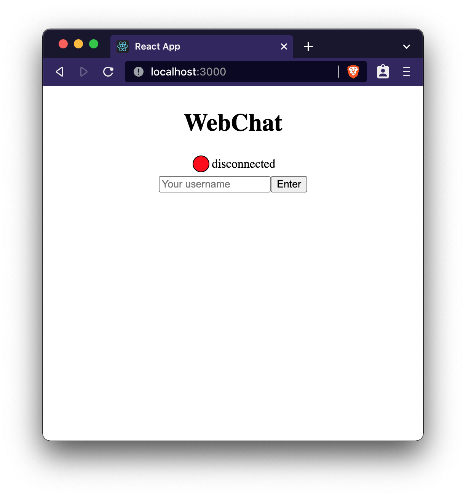
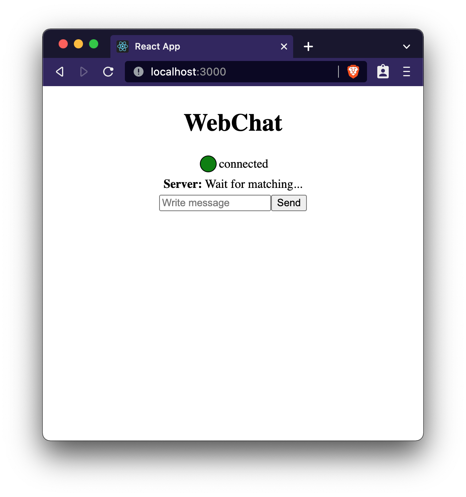
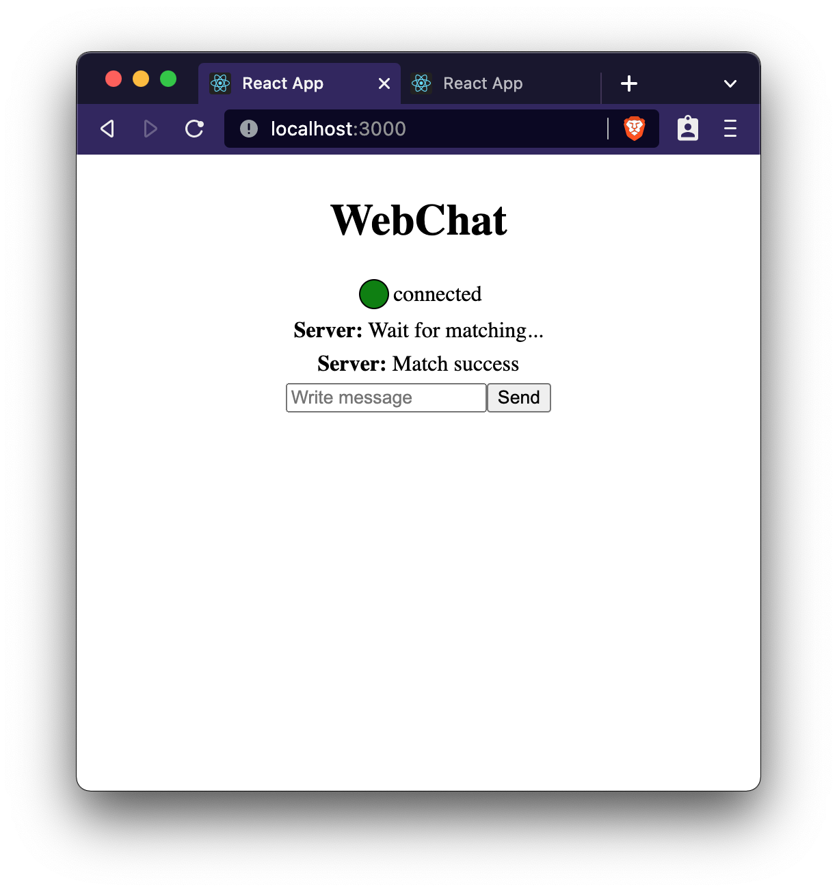
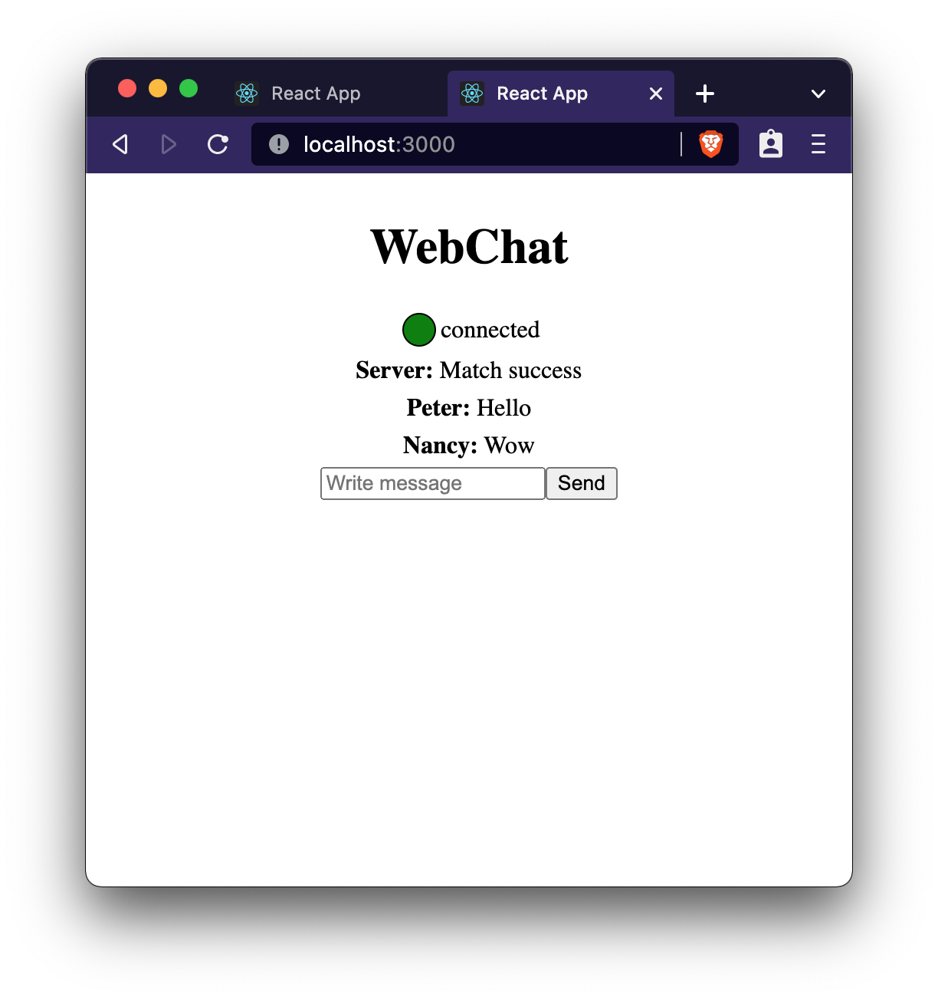

# Backend One-to-One Random Web Chat System
**Notice: The current version is at branch dev now.**

* Overview
    * When the user connect the server, he waits until another user connects.
    * When 2 users connect, they will be paired successfully and can chat together.
    * This chat process is cached by redis, stored data by mongoDB. (Not finished yet.)
    * Implemented this project by using gin, websocket and mvc structure related technologies.

## To do list

#### 1) Set configuration data in ./config/config.yaml, or it will be default

* application
    * port: (app port you want to set) 
    * chatKey and chatWait: (no need to adjust)
* redis
    * url: (redis url you set) 
    * port: (redis port you set) 
    * password: (redis password you set, the default is no password) 
    * db: (redis db you set, 0 is the default) 
* mongo
    * url: (mongo url you set) 
    * port: (mongo port you set) 
    * password: (mongo password you set, the default is no password) 
    * dababase: (what database do you want to store data) 
    * collection: (what collection do you want to store data) 

#### 2) Install package
```
go install
```

#### 3) Run the project 
```
go run main.go
```

Done.

### Combined with the results presented by my [frontend project](https://gitlab.com/wwieo055169/frontend-web_chat>).




